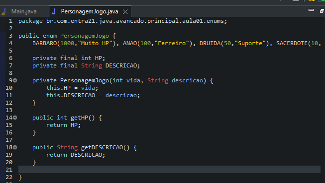

# Learning about ENUM

## ENUM
- O Java enum é um tipo de dado utilizado para armazenar um conjunto de valores constantes, ou seja, são valores fixos, que não podem ser modificados. Na prática, o enum é um tipo especial de classe que utiliza a palavra-chave enum ao ser declarado.
- Os itens de um enum são separados por vírgula, e devem ser declarados com letra maiúscula. Vale ressaltar que a palavra enum representa a abreviação de enumerations, ou enumerações, em português.
- O enum é um poderoso recurso da linguagem Java que proporciona diversos benefícios à aplicação e à pessoa programadora, pois ele ajuda a tornar o código mais limpo, reaproveitável, fácil de entender e de realizar manutenções. E não é só isso: ele contém uma série de métodos herdados e permite a criação de atributos e métodos próprios para adicionar ainda mais funcionalidade à aplicação.

## Examples 

